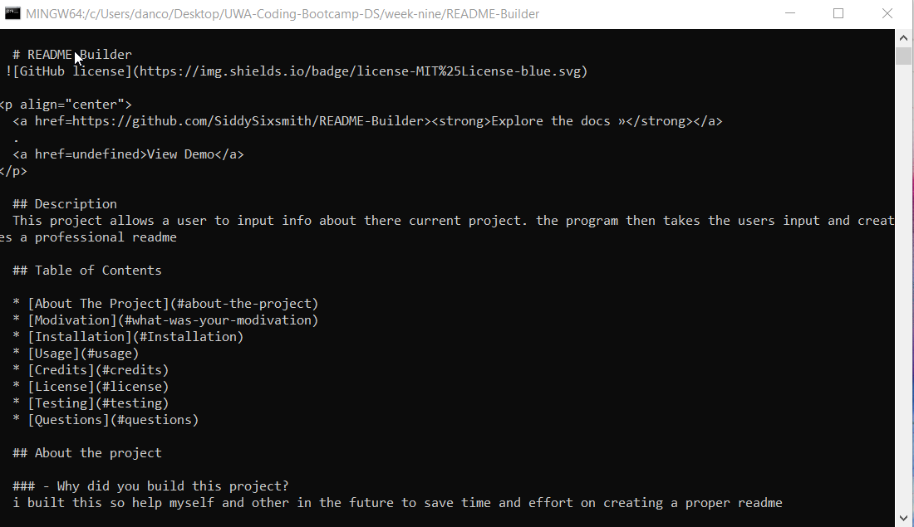

  # README Builder
 
  

  <a href=https://github.com/SiddySixsmith/README-Builder><strong>Explore the docs »</strong></a>
  .
  <a href=undefined>View Demo</a>

  ## Description
  This project allows a user to input info about there current project. the program then takes the users input and creates a professional readme

  ## Table of Contents
  
  * [About The Project](#about-the-project)
  * [Modivation](#what-was-your-modivation)
  * [Installation](#Installation)
  * [Usage](#usage)
  * [Credits](#credits)
  * [License](#license)
  * [Testing](#testing)
  * [Questions](#questions)
    
  ## About the project

  ### - Why did you build this project?
  i built this so help myself and other in the future to save time and effort on creating a proper readme

  ## Installation
  Install node or update required. npm inquierer also required

  ## Usage
  open terminal or equivilaint and run node index.js 

  ## Credits 
  N/A

 ## License
 Copyright (c) [2021] 

 The license is MIT License 

 Read more about it at https://choosealicense.com/licenses/mit/.

 ## Contrubuting Guidelines
  contributing is currently unavaliable

 ## Testing
./assets/demo1-readmebuilder.png

 ## Questions
 If you have any questions or issues with this application please feel free let me know on my profile 
 [issues](https://github.com/SiddySixsmith) or email <dancore99@outlook.com>
